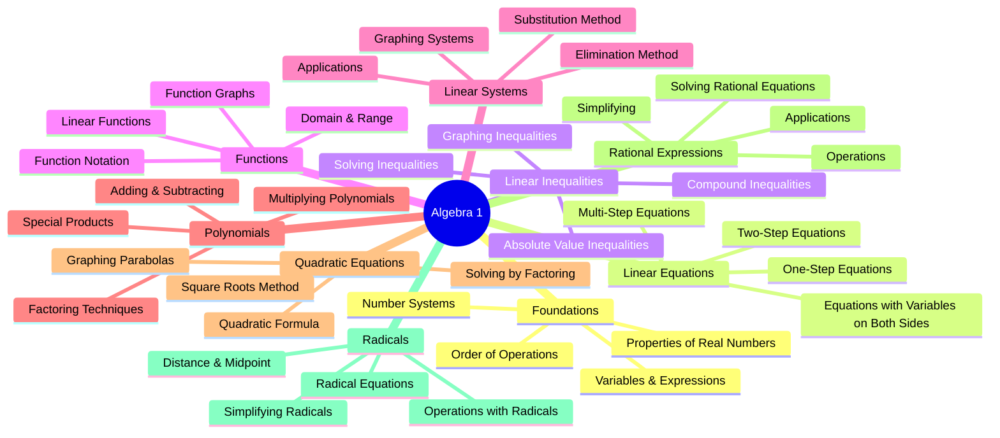

# 📚 Algebra 1 Mastery Roadmap
## Intensive Daily Practice Program

> [!info] How to Use This Roadmap
> This is an **Obsidian-compatible mindmap** for mastering Algebra 1. Each section links to daily practice tasks. Use the graph view to visualize connections between topics.

---

## 🧠 Mindmap Overview

---

# 📅 Phase 1: Foundations (Days 1-14)

## Week 1: Number Sense & Operations

### Day 1: Number Systems Review
- [x] Study the 5 number systems: Natural, Whole, Integers, Rational, Irrational
- [x] Practice: Classify 50 numbers into correct categories
- [x] Create a Venn diagram showing number system relationships
- [x] **Practice Set**: 30 problems on number classification

### Day 2: Order of Operations (PEMDAS)
- [x] Review PEMDAS rules: Parentheses, Exponents, Multiplication/Division, Addition/Subtraction
- [x] Understand left-to-right evaluation for same-precedence operations
- [x] Practice: 40 problems with increasing complexity
- [x] **Challenge Problems**: Nested parentheses and multiple operations

### Day 3: Variables and Expressions
- [x] Understand what variables represent
- [x] Translate word phrases to algebraic expressions
- [x] Evaluate expressions for given values
- [X] **Practice Set**: 25 translation problems + 25 evaluation problems

### Day 4: Properties of Real Numbers
- [x] Commutative Property: $a + b = b + a$ and $ab = ba$
- [x] Associative Property: $(a + b) + c = a + (b + c)$
- [x] Distributive Property: $a(b + c) = ab + ac$
- [x] Identity and Inverse Properties
- [x] **Practice Set**: Identify properties in 40 problems

### Day 5: Simplifying Algebraic Expressions
- [x] Combine like terms
- [x] Apply distributive property to simplify
- [x] Identify terms, coefficients, and constants
- [x] **Practice Set**: 35 simplification problems

### Day 6: Translating Words to Algebra
- [x] Key words for operations (sum, difference, product, quotient)
- [ ] Write expressions from word problems
- [ ] Create real-world scenarios from expressions
- [ ] **Practice Set**: 40 word-to-algebra translations

### Day 7: Weekly Review & Assessment
- [ ] Review all Week 1 concepts
- [ ] Complete timed practice test (30 minutes)
- [ ] Identify weak areas for extra practice
- [ ] Create summary notes in your own words

---

## Week 2: Equations Foundation

### Day 8: Introduction to Equations
- [ ] Understand equations vs expressions
- [ ] Concept of solution and equivalence
- [ ] Verify solutions by substitution
- [ ] **Practice Set**: 30 solution verification problems

### Day 9: One-Step Equations (Addition/Subtraction)
- [ ] Inverse operations concept
- [ ] Solve $x + a = b$ and $x - a = b$ forms
- [ ] Check solutions
- [ ] **Practice Set**: 40 one-step equations

### Day 10: One-Step Equations (Multiplication/Division)
- [ ] Solve $ax = b$ and $\frac{x}{a} = b$ forms
- [ ] Handle negative coefficients
- [ ] Fractional coefficients
- [ ] **Practice Set**: 40 one-step equations

### Day 11: Two-Step Equations
- [ ] Combine addition/subtraction with multiplication/division
- [ ] Standard form: $ax + b = c$
- [ ] Strategy: Undo operations in reverse order
- [ ] **Practice Set**: 45 two-step equations

### Day 12: Equations with Fractions and Decimals
- [ ] Clear fractions by multiplying by LCD
- [ ] Work with decimal coefficients
- [ ] Choose efficient strategies
- [ ] **Practice Set**: 35 equations with fractions/decimals

### Day 13: Word Problems with Equations
- [ ] Problem-solving strategy: Read, Define, Set up, Solve, Check
- [ ] Common problem types (age, number, geometry)
- [ ] Write and solve equations from context
- [ ] **Practice Set**: 25 word problems

### Day 14: Phase 1 Assessment
- [ ] Comprehensive review of foundations
- [ ] Complete Phase 1 test (45 minutes)
- [ ] Self-assessment and reflection
- [ ] Update learning journal

---

# 📅 Phase 2: Linear Equations Mastery (Days 15-28)

## Week 3: Multi-Step Equations

### Day 15: Multi-Step Equations - Distributive Property
- [ ] Apply distributive property to solve equations
- [ ] Handle negative distribution: $-a(b + c) = -ab - ac$
- [ ] Common errors and how to avoid them
- [ ] **Practice Set**: 35 distributive property equations

### Day 16: Multi-Step Equations - Combining Like Terms
- [ ] Combine like terms on same side
- [ ] Distribute and combine sequence
- [ ] Identify like terms correctly
- [ ] **Practice Set**: 35 combining terms equations

### Day 17: Variables on Both Sides
- [ ] Move variables to one side
- [ ] Choose efficient strategy (move smaller coefficient)
- [ ] Handle special cases
- [ ] **Practice Set**: 40 equations with variables on both sides

### Day 18: Special Solutions
- [ ] Identity: Equations with infinite solutions
- [ ] Contradiction: Equations with no solution
- [ ] Recognizing special cases: $x = x$ vs $x = x + 1$
- [ ] **Practice Set**: 30 problems identifying solution types

### Day 19: Literal Equations
- [ ] Solve for a specific variable in a formula
- [ ] Rearrange common formulas (distance, area, etc.)
- [ ] Apply to science formulas
- [ ] **Practice Set**: 35 literal equation problems

### Day 20: Multi-Step Word Problems
- [ ] Set up equations from complex scenarios
- [ ] Consecutive integer problems
- [ ] Perimeter and geometry problems
- [ ] **Practice Set**: 30 multi-step word problems

### Day 21: Weekly Review & Challenge
- [ ] Review all multi-step equation types
- [ ] Timed practice test (35 minutes)
- [ ] Challenge problems: Mixed equation types
- [ ] Create concept map for equations

---

## Week 4: Linear Equations Applications

### Day 22: Ratios and Proportions
- [ ] Understand ratios and equivalent ratios
- [ ] Set up and solve proportions: $\frac{a}{b} = \frac{c}{d}$
- [ ] Cross-multiplication method
- [ ] **Practice Set**: 40 proportion problems

### Day 23: Percent Applications
- [ ] Convert between fraction, decimal, percent
- [ ] Percent equation: $part = percent \times whole$
- [ ] Percent increase and decrease
- [ ] **Practice Set**: 35 percent problems

### Day 24: Percent Word Problems
- [ ] Discount and markup problems
- [ ] Tax and tip calculations
- [ ] Simple interest formula: $I = prt$
- [ ] **Practice Set**: 30 real-world percent problems

### Day 25: Rate Problems
- [ ] Distance-rate-time formula: $d = rt$
- [ ] Work-rate problems
- [ ] Average speed calculations
- [ ] **Practice Set**: 30 rate problems

### Day 26: Mixture Problems
- [ ] Set up mixture equations
- [ ] Concentration and amount
- [ ] Value mixture problems
- [ ] **Practice Set**: 25 mixture problems

### Day 27: Equation Applications Review
- [ ] Identify problem types and strategies
- [ ] Create problem-solving flowchart
- [ ] Mixed practice: All application types
- [ ] **Practice Set**: 40 mixed application problems

### Day 28: Phase 2 Assessment
- [ ] Comprehensive review of linear equations
- [ ] Complete Phase 2 test (50 minutes)
- [ ] Identify areas needing reinforcement
- [ ] Journal entry: Key insights learned

---

# 📅 Phase 3: Linear Inequalities (Days 29-42)

## Week 5: Understanding Inequalities

### Day 29: Introduction to Inequalities
- [ ] Inequality symbols: $<$, $>$, $\leq$, $\geq$
- [ ] Graphing on number line
- [ ] Interval notation basics
- [ ] **Practice Set**: 30 graphing problems

### Day 30: Solving One-Step Inequalities
- [ ] Addition and subtraction properties
- [ ] Multiplication and division (positive numbers)
- [ ] **Practice Set**: 35 one-step inequalities

### Day 31: The Critical Rule - Multiplying/Dividing by Negatives
- [ ] Why the inequality reverses
- [ ] Recognizing when to flip the sign
- [ ] Common mistakes and how to avoid
- [ ] **Practice Set**: 40 problems with negative coefficients

### Day 32: Two-Step Inequalities
- [ ] Combine operations to solve
- [ ] Graph solutions
- [ ] Check solutions by substitution
- [ ] **Practice Set**: 35 two-step inequalities

### Day 33: Multi-Step Inequalities
- [ ] Distribute and combine like terms
- [ ] Variables on both sides
- [ ] Special cases: No solution, All real numbers
- [ ] **Practice Set**: 40 multi-step inequalities

### Day 34: Compound Inequalities
- [ ] "And" inequalities: $a < x < b$
- [ ] "Or" inequalities: $x < a$ or $x > b$
- [ ] Graphing compound inequalities
- [ ] **Practice Set**: 35 compound inequality problems

### Day 35: Weekly Review
- [ ] Review all inequality types
- [ ] Create comparison chart: Equations vs Inequalities
- [ ] Timed practice test (30 minutes)
- [ ] Identify and correct recurring errors

---

## Week 6: Absolute Value & Applications

### Day 36: Absolute Value Basics
- [ ] Definition: $|x|$ as distance from zero
- [ ] Evaluate absolute value expressions
- [ ] $|x| = a$ means $x = a$ or $x = -a$
- [ ] **Practice Set**: 30 absolute value evaluations

### Day 37: Solving Absolute Value Equations
- [ ] Isolate absolute value first
- [ ] Split into two equations
- [ ] Check for extraneous solutions
- [ ] **Practice Set**: 35 absolute value equations

### Day 38: Absolute Value Inequalities - "Less Than"
- [ ] $|x| < a$ means $-a < x < a$
- [ ] Compound inequality connection
- [ ] Graphing solutions
- [ ] **Practice Set**: 30 "less than" problems

### Day 39: Absolute Value Inequalities - "Greater Than"
- [ ] $|x| > a$ means $x < -a$ or $x > a$
- [ ] Two separate solutions
- [ ] Graphing solutions
- [ ] **Practice Set**: 30 "greater than" problems

### Day 40: Inequality Word Problems
- [ ] Translate word problems to inequalities
- [ ] Budget and constraint problems
- [ ] Interpret solutions in context
- [ ] **Practice Set**: 30 word problems

### Day 41: Mixed Practice
- [ ] Equations vs Inequalities vs Absolute Value
- [ ] Choose correct solution strategy
- [ ] Comprehensive practice
- [ ] **Practice Set**: 45 mixed problems

### Day 42: Phase 3 Assessment
- [ ] Comprehensive inequalities test (45 minutes)
- [ ] Self-evaluation and reflection
- [ ] Update learning journal
- [ ] Plan for Phase 4

---

# 📅 Phase 4: Functions & Relations (Days 43-56)

## Week 7: Function Fundamentals

### Day 43: Relations and Functions
- [ ] Definition of relation and function
- [ ] Identify functions from ordered pairs
- [ ] Vertical line test for graphs
- [ ] **Practice Set**: 35 function identification problems

### Day 44: Function Notation
- [ ] Understand $f(x)$ notation
- [ ] Evaluate functions: $f(2)$, $f(-3)$, $f(a)$
- [ ] Interpret function values in context
- [ ] **Practice Set**: 40 evaluation problems

### Day 45: Domain and Range
- [ ] Find domain from equation
- [ ] Find range from equation
- [ ] Domain and range from graphs
- [ ] Restrictions: Division by zero, square roots
- [ ] **Practice Set**: 35 domain/range problems

### Day 46: Function Tables and Graphs
- [ ] Create input-output tables
- [ ] Graph functions from tables
- [ ] Identify patterns in tables
- [ ] **Practice Set**: 30 table/graph problems

### Day 47: Linear Functions
- [ ] Recognize linear functions: $f(x) = mx + b$
- [ ] Identify slope and y-intercept
- [ ] Graph linear functions
- [ ] **Practice Set**: 35 linear function problems

### Day 48: Function Composition Basics
- [ ] Understand $(f \circ g)(x) = f(g(x))$
- [ ] Evaluate composite functions
- [ ] Order matters in composition
- [ ] **Practice Set**: 30 composition problems

### Day 49: Weekly Review
- [ ] Review all function concepts
- [ ] Create function concept map
- [ ] Timed practice test (35 minutes)
- [ ] Identify areas for extra practice

---

## Week 8: Graphing & Applications

### Day 50: Slope Concept
- [ ] Slope formula: $m = \frac{y_2 - y_1}{x_2 - x_1}$
- [ ] Types of slope: positive, negative, zero, undefined
- [ ] Real-world meaning of slope
- [ ] **Practice Set**: 40 slope calculation problems

### Day 51: Slope-Intercept Form
- [ ] Graph from $y = mx + b$
- [ ] Write equation from graph
- [ ] Write equation from slope and point
- [ ] **Practice Set**: 35 slope-intercept problems

### Day 52: Point-Slope Form
- [ ] Point-slope form: $y - y_1 = m(x - x_1)$
- [ ] Write equation from two points
- [ ] Convert between forms
- [ ] **Practice Set**: 35 point-slope problems

### Day 53: Standard Form
- [ ] Standard form: $Ax + By = C$
- [ ] Convert between forms
- [ ] Find intercepts from standard form
- [ ] **Practice Set**: 30 standard form problems

### Day 54: Parallel and Perpendicular Lines
- [ ] Parallel lines: same slope
- [ ] Perpendicular lines: negative reciprocal slopes
- [ ] Write equations of parallel/perpendicular lines
- [ ] **Practice Set**: 35 parallel/perpendicular problems

### Day 55: Linear Function Applications
- [ ] Model real situations with linear functions
- [ ] Interpret slope and y-intercept in context
- [ ] Make predictions from models
- [ ] **Practice Set**: 30 application problems

### Day 56: Phase 4 Assessment
- [ ] Comprehensive functions test (50 minutes)
- [ ] Analyze strengths and weaknesses
- [ ] Create summary notes
- [ ] Prepare for systems unit

---

# 📅 Phase 5: Systems of Equations (Days 57-70)

## Week 9: Solving Systems

### Day 57: Introduction to Systems
- [ ] What is a system of equations?
- [ ] Solution as intersection point
- [ ] Types of solutions: one, none, infinite
- [ ] **Practice Set**: 25 identify solution type problems

### Day 58: Solving by Graphing
- [ ] Graph both equations
- [ ] Find intersection point
- [ ] Check solution in both equations
- [ ] **Practice Set**: 30 graphing problems

### Day 59: Solving by Substitution - Part 1
- [ ] Substitution method steps
- [ ] When one variable is isolated
- [ ] Check solutions
- [ ] **Practice Set**: 30 basic substitution problems

### Day 60: Solving by Substitution - Part 2
- [ ] Solve for a variable first
- [ ] Choose efficient variable to solve for
- [ ] Handle fractions in systems
- [ ] **Practice Set**: 35 advanced substitution problems

### Day 61: Solving by Elimination - Part 1
- [ ] Elimination method steps
- [ ] Add equations to eliminate variable
- [ ] When coefficients are opposites
- [ ] **Practice Set**: 30 basic elimination problems

### Day 62: Solving by Elimination - Part 2
- [ ] Multiply to create opposites
- [ ] Choose efficient elimination strategy
- [ ] Handle special cases
- [ ] **Practice Set**: 35 advanced elimination problems

### Day 63: Choosing the Best Method
- [ ] Compare graphing, substitution, elimination
- [ ] Identify which method works best for each system
- [ ] Mixed practice
- [ ] **Practice Set**: 30 mixed method problems

### Day 64: Weekly Review
- [ ] Review all three methods
- [ ] Create method selection flowchart
- [ ] Timed practice test (35 minutes)
- [ ] Identify preferred methods and weaknesses

---

## Week 10: Systems Applications

### Day 65: Systems Word Problems - Setup
- [ ] Identify two unknowns
- [ ] Write two equations
- [ ] Strategy for problem solving
- [ ] **Practice Set**: 25 setup problems

### Day 66: Number and Value Problems
- [ ] Two unknown numbers
- [ ] Coins and bills problems
- [ ] Ticket sales problems
- [ ] **Practice Set**: 30 number/value problems

### Day 67: Mixture Problems with Systems
- [ ] Concentration mixtures
- [ ] Investment problems
- [ ] Solution mixture problems
- [ ] **Practice Set**: 25 mixture problems

### Day 68: Rate and Distance Problems
- [ ] Motion problems with systems
- [ ] Wind and current problems
- [ ] Round trip problems
- [ ] **Practice Set**: 25 rate problems

### Day 69: Systems of Inequalities
- [ ] Graph linear inequalities
- [ ] Find solution region
- [ ] Vertices and boundaries
- [ ] **Practice Set**: 30 systems of inequalities

### Day 70: Phase 5 Assessment
- [ ] Comprehensive systems test (50 minutes)
- [ ] Review and reflection
- [ ] Connect systems to real-world applications
- [ ] Prepare for polynomials

---

# 📅 Phase 6: Polynomials (Days 71-84)

## Week 11: Polynomial Operations

### Day 71: Introduction to Polynomials
- [ ] Definition and terminology
- [ ] Degree of polynomial
- [ ] Standard form
- [ ] Classify polynomials by degree and terms
- [ ] **Practice Set**: 35 classification problems

### Day 72: Adding Polynomials
- [ ] Combine like terms
- [ ] Horizontal and vertical methods
- [ ] Multi-variable polynomials
- [ ] **Practice Set**: 35 addition problems

### Day 73: Subtracting Polynomials
- [ ] Distribute the negative
- [ ] Common errors to avoid
- [ ] Add and subtract mixed practice
- [ ] **Practice Set**: 35 subtraction problems

### Day 74: Multiplying by Monomials
- [ ] Distribute monomial to polynomial
- [ ] Power rules: $x^a \cdot x^b = x^{a+b}$
- [ ] Coefficient and variable multiplication
- [ ] **Practice Set**: 40 monomial multiplication problems

### Day 75: Multiplying Binomials - FOIL
- [ ] FOIL method: First, Outer, Inner, Last
- [ ] Area model alternative
- [ ] Multiply binomials of form $(ax + b)(cx + d)$
- [ ] **Practice Set**: 40 FOIL problems

### Day 76: Multiplying Polynomials
- [ ] Binomial × Trinomial
- [ ] Trinomial × Trinomial
- [ ] Systematic distribution method
- [ ] **Practice Set**: 35 polynomial multiplication problems

### Day 77: Special Products
- [ ] Square of sum: $(a + b)^2 = a^2 + 2ab + b^2$
- [ ] Square of difference: $(a - b)^2 = a^2 - 2ab + b^2$
- [ ] Difference of squares: $(a + b)(a - b) = a^2 - b^2$
- [ ] **Practice Set**: 40 special product problems

### Day 78: Weekly Review
- [ ] Review all polynomial operations
- [ ] Create formula reference sheet
- [ ] Timed practice test (30 minutes)
- [ ] Connect operations to real applications

---

## Week 12: Factoring

### Day 79: Introduction to Factoring
- [ ] Factoring as reverse of multiplying
- [ ] Greatest common factor (GCF)
- [ ] Factor out GCF from polynomials
- [ ] **Practice Set**: 35 GCF factoring problems

### Day 80: Factoring Trinomials - Part 1
- [ ] Factor $x^2 + bx + c$ form
- [ ] Find factors that add to middle term
- [ ] Signs of factors
- [ ] **Practice Set**: 40 basic trinomial factoring

### Day 81: Factoring Trinomials - Part 2
- [ ] Factor $ax^2 + bx + c$ form where $a \neq 1$
- [ ] AC method
- [ ] Trial and error method
- [ ] **Practice Set**: 40 advanced trinomial factoring

### Day 82: Special Factoring Patterns
- [ ] Perfect square trinomials
- [ ] Difference of squares: $a^2 - b^2 = (a+b)(a-b)$
- [ ] Sum/difference of cubes (introduction)
- [ ] **Practice Set**: 35 special pattern problems

### Day 83: Factoring Completely
- [ ] Factor out GCF first
- [ ] Continue factoring until complete
- [ ] Recognize when factoring is complete
- [ ] **Practice Set**: 40 complete factoring problems

### Day 84: Phase 6 Assessment
- [ ] Comprehensive polynomials test (45 minutes)
- [ ] Create factoring decision tree
- [ ] Self-evaluation and goal setting
- [ ] Preview quadratics unit

---

# 📅 Phase 7: Quadratic Equations (Days 85-98)

## Week 13: Solving Quadratics

### Day 85: Introduction to Quadratics
- [ ] Standard form: $ax^2 + bx + c = 0$
- [ ] Identify quadratic equations
- [ ] Quadratic term, linear term, constant
- [ ] **Practice Set**: 30 identification problems

### Day 86: Solving by Factoring
- [ ] Zero product property
- [ ] Factor then solve
- [ ] Check solutions
- [ ] **Practice Set**: 40 solve by factoring problems

### Day 87: Solving by Square Roots
- [ ] Isolate the squared term
- [ ] Take square root of both sides
- [ ] Remember $\pm$ for two solutions
- [ ] **Practice Set**: 35 square root method problems

### Day 88: Completing the Square - Part 1
- [ ] Perfect square trinomials: $(x + a)^2$
- [ ] Create perfect square trinomials
- [ ] Find the missing constant
- [ ] **Practice Set**: 30 completing square basics

### Day 89: Completing the Square - Part 2
- [ ] Solve equations by completing the square
- [ ] When $a = 1$
- [ ] Steps and process
- [ ] **Practice Set**: 35 completing square solutions

### Day 90: Completing the Square - Part 3
- [ ] When $a \neq 1$: Divide first
- [ ] Convert to vertex form
- [ ] Complex problems
- [ ] **Practice Set**: 30 advanced completing square

### Day 91: The Quadratic Formula
- [ ] Derive the formula: $x = \frac{-b \pm \sqrt{b^2-4ac}}{2a}$
- [ ] Identify $a$, $b$, and $c$
- [ ] Apply the formula correctly
- [ ] **Practice Set**: 40 quadratic formula problems

### Day 92: The Discriminant
- [ ] Discriminant: $\Delta = b^2 - 4ac$
- [ ] Predict number and type of solutions
- [ ] Positive: 2 real, Zero: 1 real, Negative: 2 complex
- [ ] **Practice Set**: 35 discriminant problems

### Day 93: Choosing a Solution Method
- [ ] Compare: factoring, square roots, completing square, formula
- [ ] Efficient method selection
- [ ] Mixed practice
- [ ] **Practice Set**: 40 mixed method problems

### Day 94: Weekly Review
- [ ] Review all solution methods
- [ ] Create method selection flowchart
- [ ] Timed practice test (40 minutes)
- [ ] Address remaining questions

---

## Week 14: Quadratic Applications

### Day 95: Graphing Parabolas - Basics
- [ ] Shape and properties of parabolas
- [ ] Vertex, axis of symmetry
- [ ] Direction of opening (up/down)
- [ ] **Practice Set**: 30 graphing basics

### Day 96: Graphing from Standard Form
- [ ] Find vertex: $x = \frac{-b}{2a}$
- [ ] Find y-intercept: $(0, c)$
- [ ] Sketch parabola
- [ ] **Practice Set**: 30 standard form graphing

### Day 97: Graphing from Vertex Form
- [ ] Vertex form: $y = a(x-h)^2 + k$
- [ ] Identify vertex $(h, k)$
- [ ] Transformations from $y = x^2$
- [ ] **Practice Set**: 30 vertex form graphing

### Day 98: Phase 7 Assessment
- [ ] Comprehensive quadratics test (50 minutes)
- [ ] Create quadratic summary sheet
- [ ] Real-world connections
- [ ] Prepare for final units

---

# 📅 Phase 8: Advanced Topics (Days 99-112)

## Week 15: Rational Expressions

### Day 99: Simplifying Rational Expressions
- [ ] Definition of rational expression
- [ ] Excluded values (domain restrictions)
- [ ] Factor and simplify
- [ ] **Practice Set**: 35 simplification problems

### Day 100: Multiplying Rational Expressions
- [ ] Multiply numerators and denominators
- [ ] Factor and cancel common factors
- [ ] Simplify completely
- [ ] **Practice Set**: 30 multiplication problems

### Day 101: Dividing Rational Expressions
- [ ] Multiply by reciprocal
- [ ] Factor, flip, cancel
- [ ] Mixed operations
- [ ] **Practice Set**: 30 division problems

### Day 102: Adding and Subtracting - Same Denominator
- [ ] Add/subtract numerators
- [ ] Keep common denominator
- [ ] Simplify result
- [ ] **Practice Set**: 30 same denominator problems

### Day 103: Adding and Subtracting - Different Denominators
- [ ] Find LCD
- [ ] Create equivalent fractions
- [ ] Add/subtract and simplify
- [ ] **Practice Set**: 35 different denominator problems

### Day 104: Solving Rational Equations
- [ ] Multiply both sides by LCD
- [ ] Clear fractions
- [ ] Check for extraneous solutions
- [ ] **Practice Set**: 30 rational equation problems

### Day 105: Weekly Review
- [ ] Review all rational operations
- [ ] Create rational expression summary
- [ ] Timed practice test (35 minutes)
- [ ] Address challenging problems

---

## Week 16: Radicals & Final Review

### Day 106: Simplifying Radicals
- [ ] Perfect square factors
- [ ] Product property: $\sqrt{ab} = \sqrt{a} \cdot \sqrt{b}$
- [ ] Simplify completely
- [ ] **Practice Set**: 40 radical simplification problems

### Day 107: Operations with Radicals
- [ ] Add and subtract like radicals
- [ ] Multiply radicals
- [ ] Simplify after operations
- [ ] **Practice Set**: 35 operations problems

### Day 108: Rationalizing Denominators
- [ ] Rationalize simple denominators
- [ ] Rationalize with conjugates: $\frac{1}{a+\sqrt{b}}$
- [ ] Simplify completely
- [ ] **Practice Set**: 30 rationalizing problems

### Day 109: Solving Radical Equations
- [ ] Isolate the radical
- [ ] Square both sides
- [ ] Check for extraneous solutions
- [ ] **Practice Set**: 35 radical equation problems

### Day 110: Distance and Midpoint Formulas
- [ ] Distance formula: $\sqrt{(x_2-x_1)^2 + (y_2-y_1)^2}$
- [ ] Midpoint formula: $\left(\frac{x_1+x_2}{2}, \frac{y_1+y_2}{2}\right)$
- [ ] Applications
- [ ] **Practice Set**: 30 distance/midpoint problems

### Day 111: Final Comprehensive Review - Part 1
- [ ] Equations and inequalities review
- [ ] Functions and graphing review
- [ ] **Practice Set**: 50 mixed problems

### Day 112: Final Comprehensive Review - Part 2
- [ ] Systems and polynomials review
- [ ] Quadratics and rationals review
- [ ] **Practice Set**: 50 mixed problems

---

# 🎯 Phase 9: Mastery & Assessment (Days 113-120)

### Day 113: Weakness Targeting
- [ ] Review test results from all phases
- [ ] Identify top 3 weakness areas
- [ ] Targeted practice on weaknesses
- [ ] Create improvement plan

### Day 114: Speed and Accuracy Practice
- [ ] Timed drills on all topics
- [ ] Focus on common problem types
- [ ] Build speed without sacrificing accuracy
- [ ] **Practice Set**: 60 mixed timed problems

### Day 115: Problem-Solving Strategies
- [ ] Advanced problem-solving techniques
- [ ] Multi-step complex problems
- [ ] Real-world applications
- [ ] **Practice Set**: 25 challenging problems

### Day 116: Practice Exam 1
- [ ] Full-length practice test (60 minutes)
- [ ] Simulate test conditions
- [ ] Time management practice
- [ ] Review all answers

### Day 117: Practice Exam 2
- [ ] Full-length practice test (60 minutes)
- [ ] Different question types
- [ ] Focus on weak areas from Exam 1
- [ ] Complete review

### Day 118: Final Review Session
- [ ] Review all key formulas
- [ ] Create final cheat sheet
- [ ] Address any remaining questions
- [ ] Mental preparation

### Day 119: Comprehensive Final Exam
- [ ] Final assessment (90 minutes)
- [ ] All Algebra 1 topics
- [ ] Measure mastery level

### Day 120: Celebration & Next Steps
- [ ] Review final exam results
- [ ] Celebrate completion!
- [ ] Plan for Algebra 2
- [ ] Update learning portfolio

---

# 📊 Progress Tracking

## Daily Progress Tracker

| Phase | Days | Topic | Status | Score |
|-------|------|-------|--------|-------|
| 1 | 1-14 | Foundations | ⬜ | /100 |
| 2 | 15-28 | Linear Equations | ⬜ | /100 |
| 3 | 29-42 | Inequalities | ⬜ | /100 |
| 4 | 43-56 | Functions | ⬜ | /100 |
| 5 | 57-70 | Systems | ⬜ | /100 |
| 6 | 71-84 | Polynomials | ⬜ | /100 |
| 7 | 85-98 | Quadratics | ⬜ | /100 |
| 8 | 99-112 | Advanced | ⬜ | /100 |
| 9 | 113-120 | Mastery | ⬜ | /100 |

**Status Key:** ⬜ Not Started | 🔄 In Progress | ✅ Complete

---

## Key Formulas Reference

### Linear Equations
- Slope: $m = \frac{y_2 - y_1}{x_2 - x_1}$
- Slope-Intercept Form: $y = mx + b$
- Point-Slope Form: $y - y_1 = m(x - x_1)$
- Standard Form: $Ax + By = C$

### Quadratic Equations
- Quadratic Formula: $x = \frac{-b \pm \sqrt{b^2-4ac}}{2a}$
- Discriminant: $\Delta = b^2 - 4ac$
- Vertex Form: $y = a(x-h)^2 + k$
- Vertex x-coordinate: $x = \frac{-b}{2a}$

### Special Products
- $(a+b)^2 = a^2 + 2ab + b^2$
- $(a-b)^2 = a^2 - 2ab + b^2$
- $(a+b)(a-b) = a^2 - b^2$

### Distance & Midpoint
- Distance: $d = \sqrt{(x_2-x_1)^2 + (y_2-y_1)^2}$
- Midpoint: $M = \left(\frac{x_1+x_2}{2}, \frac{y_1+y_2}{2}\right)$

---

## 📝 Study Tips for Success

> [!tip] Daily Practice Routine
> 1. **Warm-up** (5 min): Review previous day's notes
> 2. **New Learning** (20 min): Study new concept
> 3. **Guided Practice** (15 min): Work through examples
> 4. **Independent Practice** (20 min): Complete practice set
> 5. **Reflection** (5 min): Write summary and questions

> [!warning] Common Mistakes to Avoid
> - Forgetting to flip inequality sign with negative multiplication
> - Not checking solutions in original equation
> - Sign errors in distribution
> - Forgetting the $\pm$ when taking square roots
> - Not checking for extraneous solutions

> [!success] Mastery Indicators
> - Can explain concepts to others
> - Can identify problem types quickly
> - Can solve problems multiple ways
> - Can catch own errors
> - Can apply to real-world situations

---

## 🔗 Related Topics (For Future Study)

- [[Geometry]] - Uses algebra throughout
- [[Algebra 2]] - Builds on all Algebra 1 concepts
- [[Pre-Calculus]] - Functions and advanced equations
- [[Statistics]] - Uses linear models

---

*Created for intensive daily practice | Total: 120 Days | ~1 hour daily commitment*
